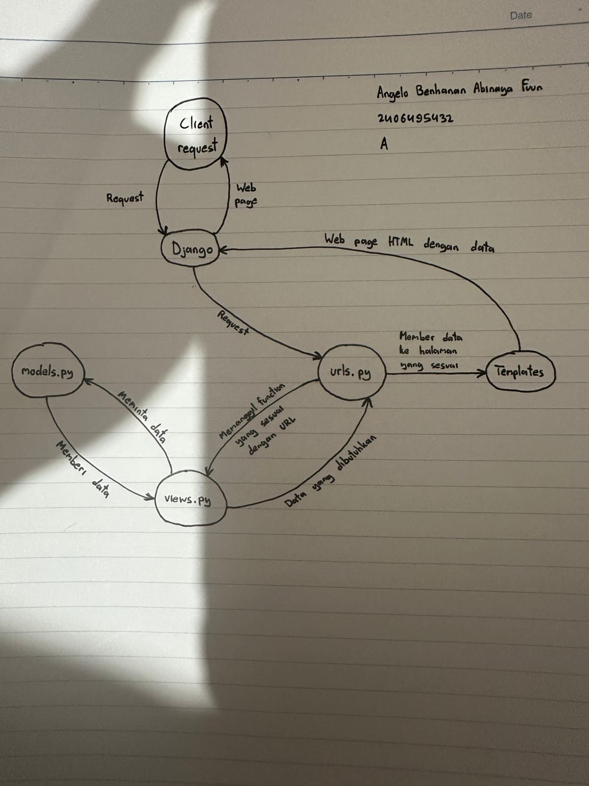

Jelaskan bagaimana cara kamu mengimplementasikan checklist di atas secara step-by-step (bukan hanya sekadar mengikuti tutorial).

Saya melihat atribut-atribut apa saja di checklist lalu mengimplementasikannya di model Bola dengan parameter-parameter yang sesuai untuk atribut-atribut tersebut. Setelah itu, saya mengolah data-data tersebut di function-function untuk halaman-halaman website saya di fiel views.py dan menghubungkan function-function tersebut ke link-link khusus di file urls.py.

Buatlah bagan yang berisi request client ke web aplikasi berbasis Django beserta responnya dan jelaskan pada bagan tersebut kaitan antara urls.py, views.py, models.py, dan berkas html.

Jelaskan peran settings.py dalam proyek Django!

File settings.py adalah control center proyek Django di mana file tersebut mengendalikan bagaimana proyek bekerja dalam environment.

Bagaimana cara kerja migrasi database di Django?

Di Django, migrasi akan melihat perubahan-perubahan di file models.py lalu, jika terdeteksi adanya perubahan, perubahan-perubahan tersebut akan diaplikasikan ke database (penambahan/penghapusan model, perubahan atribut, dll). 

Menurut Anda, dari semua framework yang ada, mengapa framework Django dijadikan permulaan pembelajaran pengembangan perangkat lunak?

Menurut saya, framework Django dijadikan permulaan pembelajaran pengembangan perangkat lunak karena Django menggunakan bahasa pemrograman Python, bahasa pemrograman yang relatif mudah untuk dipahami, dan karena Django memiliki struktur yang mudah dipahami.

Apakah ada feedback untuk asisten dosen tutorial 1 yang telah kamu kerjakan sebelumnya?

Tidak ada, informasi untuk tutorial 1 sudah sangat baik dan jelas.