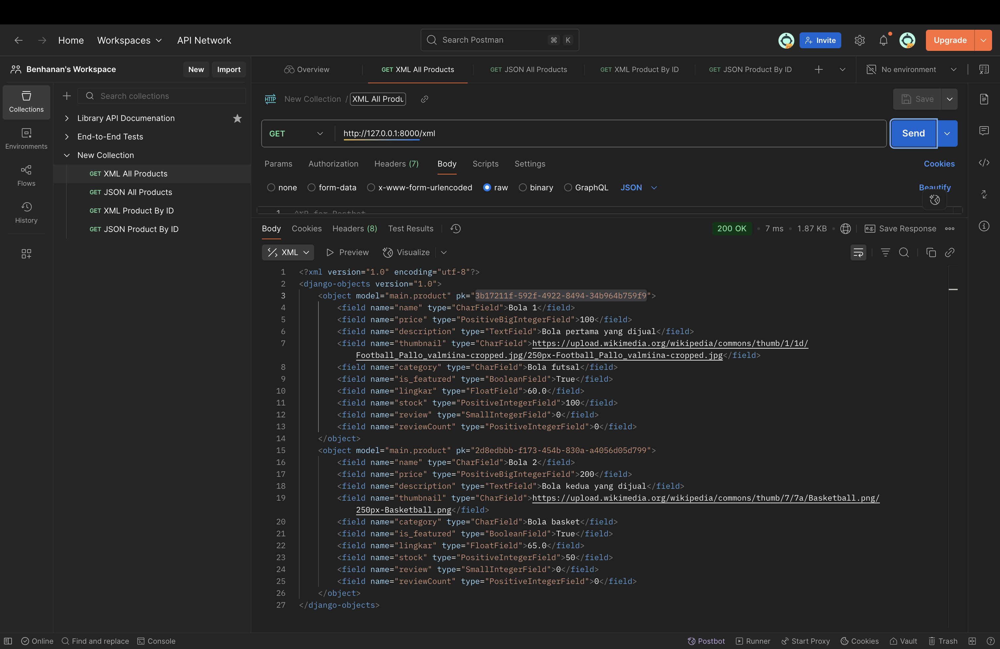
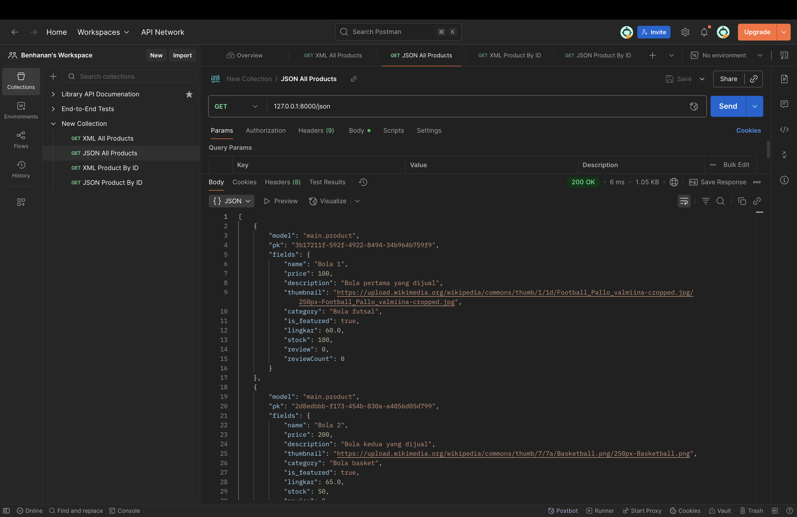
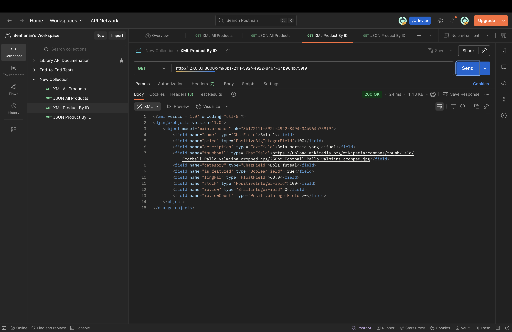
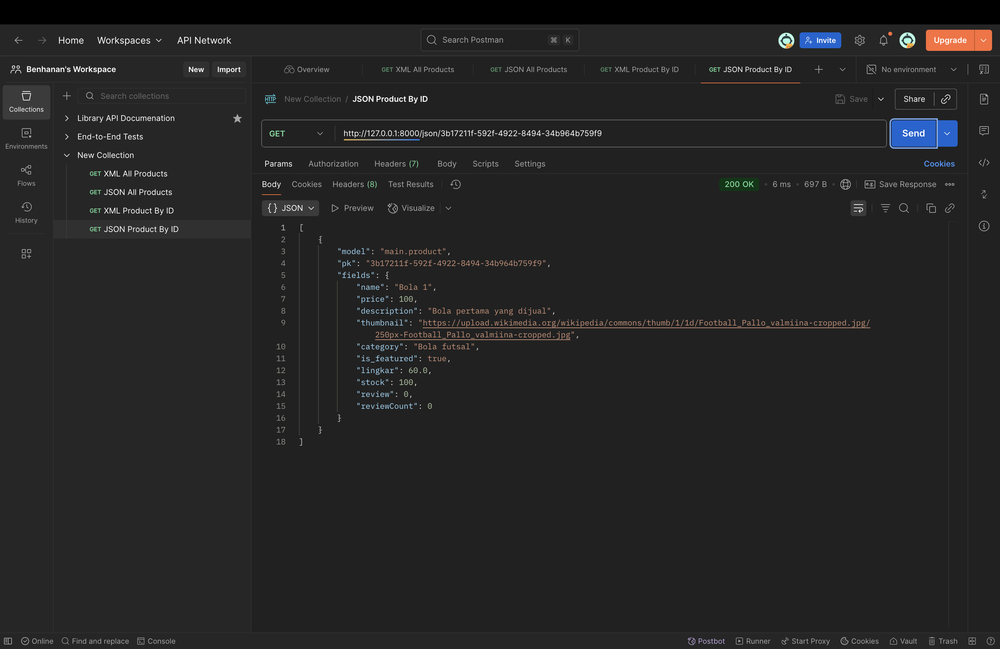

# **TUGAS INDIVIDU 1**

### Jelaskan bagaimana cara kamu mengimplementasikan checklist di atas secara step-by-step (bukan hanya sekadar mengikuti tutorial).

Saya melihat atribut-atribut apa saja di checklist lalu mengimplementasikannya di model Bola dengan parameter-parameter yang sesuai untuk atribut-atribut tersebut. Setelah itu, saya mengolah data-data tersebut di function-function untuk halaman-halaman website saya di fiel views.py dan menghubungkan function-function tersebut ke link-link khusus di file urls.py.

### Buatlah bagan yang berisi request client ke web aplikasi berbasis Django beserta responnya dan jelaskan pada bagan tersebut kaitan antara urls.py, views.py, models.py, dan berkas html.

### Jelaskan peran settings.py dalam proyek Django!

File settings.py adalah control center proyek Django di mana file tersebut mengendalikan bagaimana proyek bekerja dalam environment.

### Bagaimana cara kerja migrasi database di Django?

Di Django, migrasi akan melihat perubahan-perubahan di file models.py lalu, jika terdeteksi adanya perubahan, perubahan-perubahan tersebut akan diaplikasikan ke database (penambahan/penghapusan model, perubahan atribut, dll). 

### Menurut Anda, dari semua framework yang ada, mengapa framework Django dijadikan permulaan pembelajaran pengembangan perangkat lunak?

Menurut saya, framework Django dijadikan permulaan pembelajaran pengembangan perangkat lunak karena Django menggunakan bahasa pemrograman Python, bahasa pemrograman yang relatif mudah untuk dipahami, dan karena Django memiliki struktur yang mudah dipahami.

### Apakah ada feedback untuk asisten dosen tutorial 1 yang telah kamu kerjakan sebelumnya?

Tidak ada, informasi untuk tutorial 1 sudah sangat baik dan jelas.

# **TUGAS INDIVIDU 2**

### Jelaskan mengapa kita memerlukan data delivery dalam pengimplementasian sebuah platform?

Data delivery diperlukan dalam pengimplementasian sebuah platform karena data delivery memungkinkan terjadinya komunikasi antara pengguna dan perangkat dengan transfer data yang cepat dan dalam bentuk yang dipahami berbagai perangkat.

### Menurutmu, mana yang lebih baik antara XML dan JSON? Mengapa JSON lebih populer dibandingkan XML?

Menurut saya, JSON lebih baik dan lebih populer dibandingkan XML karena JSON memiliki format yang lebih mudah dipahami dan mendapat native support di JavaScript.

### Jelaskan fungsi dari method is_valid() pada form Django dan mengapa kita membutuhkan method tersebut?

Method is_valid() pada form Django berfungsi untuk memvalidasi input dari user dan memberi error jika input tidak sesuai. Dengan begitu, method is_valid() dapat membantu menjaga keamanan aplikasi dan konsistensi data.  

### Mengapa kita membutuhkan csrf_token saat membuat form di Django? Apa yang dapat terjadi jika kita tidak menambahkan csrf_token pada form Django?

csrf_token dibutuhkan saat membuat form di Django untuk menjaga aplikasi dari serangan CSRF sehingga data dalam aplikasi terjaga dengan aman. Tanpa adanya csrf_token, aplikasi kita akan lebih rentan terhadap serangan siber.

### Bagaimana hal tersebut dapat dimanfaatkan oleh penyerang?

Tanpa adanya CSRF token, penyerang dapat membuat request palsu dan/atau melakukan manipulasi data.

### Jelaskan bagaimana cara kamu mengimplementasikan checklist secara step-by-step (bukan hanya sekadar mengikuti tutorial).

1. Cek ketentuan tugas.
2. Buat form XML dan JSON untuk seluruh Product.
3. Buat form XML dan JSON untuk Product tertentu dengan id.
4. Buat form ProductCreationForm untuk membuat Product baru.
5. Buat method-method validasi untuk seluruh data yang diterima ProductCreationForm.
6. Pastikan method-method validasi tersebut sudah sesuai dengan data yang divalidasi dan memberi error message yang sesuai.
7. Lakukan modifikasi terhadap code untuk mempersingkat dan memperjelas code.

### Apakah ada feedback untuk asdos di tutorial 2 yang sudah kalian kerjakan?

Tidak ada, informasi untuk tutorial 1 sudah sangat baik dan jelas.

## Screenshot Postman Untuk Access URL XML dan JSON Data Delivery

